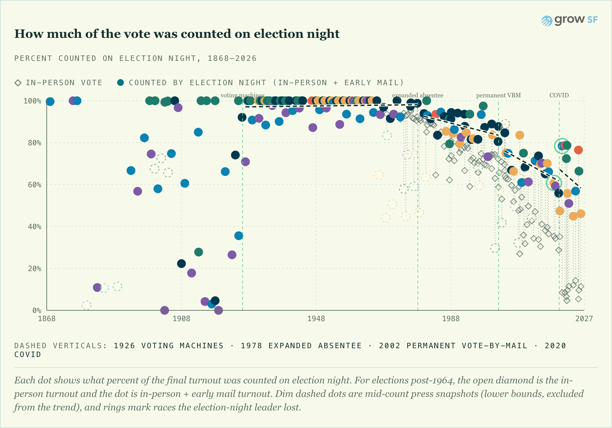
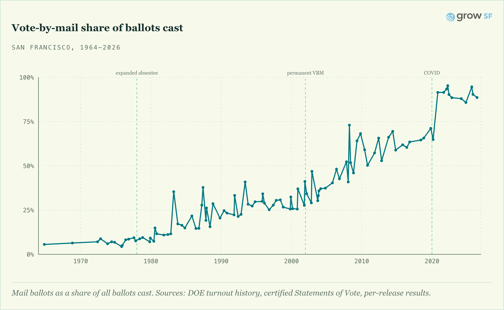
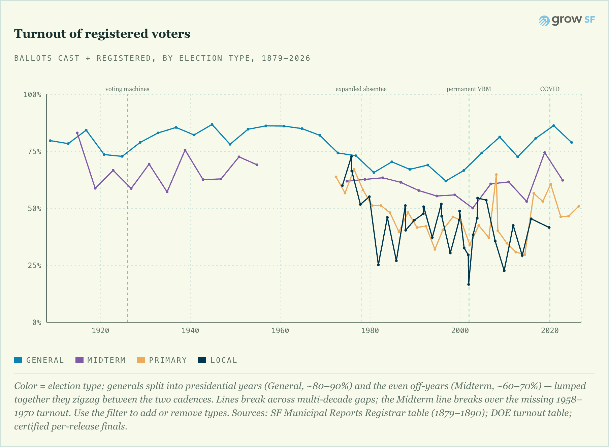
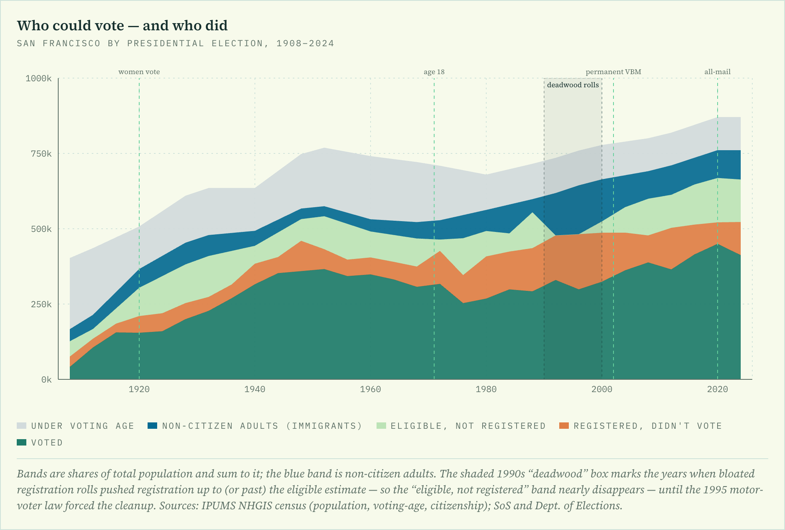

# The Long Count

**How long San Francisco takes to know who won — a century-plus of it.**

It takes far longer to learn the outcome of a San Francisco election than it
used to. Not because the count itself got slower — the back-end pace of
processing a ballot is about what it always was — but because of what changed
around it: vote-by-mail grew from a sliver of the vote in the 1960s to nine in
ten today, and those ballots arrive late and need signature checks before they
can be counted. So election night went from telling us almost everything to
telling us barely half, and the result that once was clear by midnight now can
take days or weeks. This project measures that shift from primary sources —
the Department of Elections' own results releases plus a deep recovery of
historical counts from newspaper and web archives — and tells the story in an
interactive site.

Live data spans **1868–2026** (turnout back to 1879, registration back to 1908,
election-night counts back to 1868): 208 elections with an election-night count
(including 105 pre-1965 counts recovered from the hand-count and machine eras,
back to 1868), 346 recovered historical canvass observations, and 241 modern
per-release reports, every number traceable to a cited source. The long view
reveals distinct eras — _erratic_ in the hand-count era (1868–1922, when ballot
length, not the calendar, set the pace: ~61% counted by morning in 1908 but
effectively nothing in 1918's long-ballot election), fast and near-complete once
lever voting machines arrived (1928–1990s), and the modern mail-driven slide —
see
[`docs/analysis/2026-06-13-a-century-of-election-nights.md`](docs/analysis/2026-06-13-a-century-of-election-nights.md).

---

## The story, in four charts

**Election night tells you less every cycle.** The share of the vote counted by
the morning after has collapsed since ~2002 — though the long view shows it
failed before, too, in the 1910s, for the opposite reason (hand-counting long
Progressive-era ballots). The record now reaches back to 1868, when San
Francisco's small electorate was counted in full overnight (~100%).

**What changed is the mail.** Vote-by-mail grew from a sliver in the 1960s to
nine in ten today. Those ballots arrive late and need signature checks, so the
count physically moved off election day.

**More mail didn't mean more voting.** Turnout *of registered voters* has barely
budged — presidential generals still top the range, off-year municipals still sit
at the bottom, just as they did in the 1880s (when ~92–95% of registered San
Franciscans voted in the big races). The mail moved *when* ballots are counted,
not *whether* people cast them.

**Did that expand the franchise? No — and the real story is a century of
immigration.** Every San Franciscan as a band of the whole population: women's
suffrage (1920) doubled the eligible electorate, and the non-citizen band
(blue) breathes with the city's immigration history — wide in the Gold-Rush era,
thin at mid-century, widening again after 1965.

*Static snapshots — explore all of it interactively, filtered and zoomable, in
the published story on [GrowSF](https://growsf.org), or run the charts locally
with the preview harness (`pnpm install && pnpm --filter @long-count/preview
exec vite`). (Regenerate these images with `node scripts/shoot_charts.cjs`
against the running preview harness.)*

---

## Repository map

| Path | What it is |
|---|---|
| `sfcount/` | Python pipeline: ingests DOE per-release reports (2015–present) |
| `data/` | All committed datasets (CSV) — the source of truth |
| `packages/` | `data/` (committed JSON, baked from `data/`) + `charts/` (the reusable React charts the GrowSF site embeds) |
| `scripts/` | generators (`build_viz_data.py`, `build_elections_master.py`, `gen_docs.py`, `build_county_night.py`, `build_franchise_csv.py`) + `research/` (county verification) + `archive-recovery/` (NewsBank) + Chronicle/CDX recovery tooling |
| `docs/` | Methodology, runbook, search log, the records-request draft |
| `mirror/` | **gitignored** — licensed NewsBank/Chronicle source content (cited, never republished) |

## Key datasets (`data/`)

- `sf_count_timeline.csv` — modern per-release counts (the `sfcount` output).
- `sf_archival_canvass_points.csv` — recovered historical observations
  (1868–2014); schema and method in the runbook.
- `sf_turnout_history_doe_1899_2019.csv` — DOE certified turnout (the
  denominators). Known data-quality issues tracked in
  `docs/denominator-errors.md`.
- `sf_vbm_share_sos.csv`, `sf_turnout_history_1960_2002.csv` — mail-share and
  precinct/absentee splits from the CA Secretary of State and DOE.
- `sf_registration_eligible*.csv`, `sf_eligible_vap_estimate.csv` — registered,
  eligible-citizen, and voting-age population (CA Secretary of State + U.S.
  Census via IPUMS NHGIS), 1900–2026.

**→ Full data dictionary — every file and every column — in
[`data/README.md`](data/README.md).**

## The modern pipeline (`sfcount`)

Ingests the structured files SF Elections publishes per release —
`summary.xml` (2019+) and `summary.txt` TSV (2008–2018) — rather than parsing
PDFs. Timestamps come from HTTP `Last-Modified` headers (`data/manifest.csv`).

    uv run sfcount all        # inventory → fetch → parse → validate → derive
    uv run sfcount fetch      # resumable; ~25 min cold
    uv run pytest             # offline suite (real downloaded fixtures)
    pnpm vitest run           # JS/TS chart tests (repo root; there is no "test" script alias)

After a new election: add it to `SUPPLEMENTAL_ELECTIONS` in
`sfcount/inventory.py` if sf.gov doesn't list it yet; run `uv run sfcount all`
during the canvass; after certification add the certified total to
`CERTIFIED_FINALS` in `sfcount/validate.py` and commit `data/`.

## The charts (`packages/charts`)

A reusable React charts package built entirely from the committed datasets —
the same charts the [GrowSF](https://growsf.org) story embeds: the
election-night-share trend (a fitted line per voting era — fast-count,
absentee, permanent vote-by-mail, slow-count), an any-margin "days until
the winner is beyond doubt" explorer, the 1964–2026 mail-ballot share, and a
per-canvass trajectory explorer. The website consumes it as a pinned git
dependency; the charts read from `packages/data` (committed JSON, baked from
`data/` by `scripts/build_viz_data.py`).

For local development and preview, run the harness; the underlying records are
documented in the repo: the search log in
[`docs/analysis/public-search-log.md`](docs/analysis/public-search-log.md),
every number linked to its archive in [`docs/sources.md`](docs/sources.md), and
the open research list in [`docs/missing.md`](docs/missing.md).

    python3 scripts/build_viz_data.py            # rebake packages/data JSON after the pipeline runs
    pnpm install && pnpm --filter @long-count/preview exec vite   # local charts preview (:4317)

## Archive recovery (the historical data)

Most of the 1908–2014 record was recovered by hand-and-agent from newspaper
and web archives. If you want to extend it, **start with
[`docs/archive-recovery-runbook.md`](docs/archive-recovery-runbook.md)** — the
full method: which archive holds which era, the browser-automation and
agent workflow, the verification gates, and the lessons (including why an
apparent "contradiction" is usually a bad denominator, not a misread).

Supporting docs:
- `docs/analysis/newsbank-agent-playbook.md` — capture + reader-agent rules.
- `docs/analysis/public-search-log.md` — what's already been searched (so you
  don't redo it).
- `docs/denominator-errors.md` — DOE turnout figures contradicted by the
  count, for manual verification.
- `docs/doe-records-request.md` — drafted public-records request for the
  remaining gaps.

Reusable tooling lives in `scripts/archive-recovery/` (browser capture, text
harvest, OCR triage, column location). These drive a logged-in Chrome over an
SFPL library session; prerequisites are in the runbook.

The Chronicle fetch/scan scripts (`scripts/fetch_chronicle.py`, `scripts/fetch_phase2.py`, `scripts/scan_*.py`,
`scripts/sweep_*.py`, `scripts/extract_sf_ballot.py`) write to and read from the
gitignored `mirror/chronicle-sfgate/` by default, resolved relative to the repo.
Set `SF_MIRROR_DIR` to point them at a mirror kept elsewhere:

    SF_MIRROR_DIR=/path/to/mirror python3 scripts/fetch_chronicle.py

(`scripts/fetch_sos_registration.py` is NOT a mirror script despite the name:
it pulls CA SoS registration PDFs into `data/` and needs `pdftotext`;
`scripts/recover_sov_registration.py` needs ImageMagick; the NewsBank triage
uses `tesseract`. None of these binaries are in pyproject; install via brew.)

## Help us recover the missing elections

**55 San Francisco elections still lack an election-night count** — see
[`data/elections_master.csv`](data/elections_master.csv) (the `recovered=no` rows)
and [`docs/missing.md`](docs/missing.md). Most are pre-1907, above all the 1856–1905 mayoral
elections. None are lost causes: the returns were printed at the time and survive
in the newspaper archive. You can help find them — no special skills needed.

**How to look:**

1. Get a free **San Francisco Public Library card** — SF residents can sign up
   online at [sfpl.org](https://sfpl.org). (Anyone in California can get one.)
2. Your card unlocks the **San Francisco Chronicle archive on NewsBank** (it goes
   back to 1865), through SFPL's online databases — use the *Access World News /
   image edition*.
3. Pick a missing election and note its **date** from `elections_master.csv`.
4. Open the **day-after issue** and find the San Francisco returns. For elections
   before ~1985 use the **image edition** and page through the front pages: look for
   a box headed **"ELECTION RETURNS," "VOTE OF THE CITY,"** or **"THE CITY"** with a
   per-candidate San Francisco table. Helpful search terms: the office + candidate
   surnames, `"vote of the city"`, `"election returns"`.
5. **Check the masthead date** matches the election's day-after — NewsBank's issue
   labels are sometimes off by a day.
6. Take a clear **photo or screenshot** of the returns box.

**How to contribute what you find:**

- **Open a pull request** adding your source (a citation plus the figures) to the
  relevant file in `data/`, **or**
- **Email [contact@growsf.org](mailto:contact@growsf.org)** with the photo/scan, the
  election date, which contest, and where you found it.

Every submission is verified against certified totals and credited in
[`docs/sources.md`](docs/sources.md). Before you dig,
[`docs/missing.md`](docs/missing.md) notes what's already been tried for each.

## Open work & roadmap

Outstanding tasks, newest first. Detailed per-item tracking lives in the linked
ledgers; this is the index.

### Missing from the night-count record (elections we lack data for)

None of these are *impossible* — the returns exist in some edition, microfilm,
the County Clerk/Registrar's canvass, or the state Statement of Vote; we just
haven't recovered them yet. The full election-by-election list is now
[`data/elections_master.csv`](data/elections_master.csv) (built by
[`scripts/build_elections_master.py`](scripts/build_elections_master.py)) — **279
San Francisco elections, 1849–2026**, each flagged by whether we hold a night
count: **208 recovered · 71 still missing** (23 of the missing at least have a
known final count; 48 have no recovered data at all). The categories below
summarize the missing. (The total rose in July 2026: the Municipal Reports
cumulative Registrar tables exposed a spurious index entry, Nov 1 1898, three
previously unindexed specials, and then four more 1878-1887 elections plus
true dates for three rejected charters; see the search log.)

**Pre-1892 statewide generals** (certified SF denominators already in hand — see
[`data/pre1892_certified.md`](data/pre1892_certified.md); only the night count is missing)
- [ ] **1871 Gov** — capture hit the *Oakland* Daily Transcript (no SF returns); pull a San Francisco paper (Alta / Morning Call) for Sept 7 1871.
- [ ] **1872 Pres** — capture hit a *German-language* SF daily; pull the English SF paper for Nov 6 1872.
- [ ] **1879 Gov** — not yet attempted (turnout point exists; no night-count capture).
- [ ] **1880 Pres** — only a prose *Evening Bulletin* ("two-thirds count") found; pull the morning Chronicle/Alta overnight tally for Nov 3 1880.
- [ ] **1884 Pres** — only a prose *Evening Bulletin* 4th ed.; pull the morning paper for Nov 5 1884.
- [ ] **1888 Pres** — *Evening Bulletin* entry docref won't paginate; pull the Chronicle front page for Nov 7 1888.
- [ ] **1867 Gov** — the day-after morning paper printed only an editorial + a margin (count unfinished at press time); the full canvass is in a later issue or the County Clerk's returns — pull a 2–3-day-later SF paper.
- [ ] **1886 Gov (~29%), 1890 Gov (~12%)** — recovered but digits soft; hand-verify the sent crops, then finalize.

**Pre-1867 statewide generals** — the entire run is unrecovered (no night counts
*and* no certified SF figures gathered yet): President **1852, 1856, 1860, 1864**;
Governor **1849, 1851, 1853, 1855, 1857, 1859, 1861, 1863**. Likely source: the
*Daily Alta California* (on NewsBank from 1849); certified via the California Blue
Book / Bancroft.

**Pre-1907 SF municipals** — the 1897–1906 stretch is now recovered from the SF
Call on CDNC (the free California Digital Newspaper Collection; see the search
log for the method): night or complete counts for the 1897 Freeholders, 1898
charter ratification, and the 1899/1901/1903/1905 mayoral elections, with
certified denominators from the Municipal Reports cumulative table. Still open:
the 1850s–1895 municipals (the Consolidation-era odd-year and consolidated
even-year races), where the Daily Alta California and the Call on CDNC are the
next vein.

**Pre-1928 primaries** — California's direct primary began 1909; primaries **~1910–1926**
are unrecovered (the ledger's primary tier starts 1928).

**Modern night-count gaps** (tracked in [`docs/missing.md`](docs/missing.md)): **1995-12** runoff,
**1999-11** (Ammiano write-in), **2000-11**, **2003-10** (Davis recall), **2006-11**,
**2010-11** — the city's results databases for these were stale or never captured.

**Recovered-as-SKIP** — the captured edition never printed a complete count; need
the county Statement of Vote: **1915-03, 1928-08, 1929-11, 1944-05, 1944-11, 1945-11**
(see [`data/recovery_ledger_pre1965.md`](data/recovery_ledger_pre1965.md)).

**Mid-century city gaps (1966–1984)** — RESOLVED July 2026 (Chronicle NewsBank
image sweep; method and per-election outcomes in the search log). All 16 post-1965
gaps were attempted: night counts recovered for the generals (1966-11, 1970-11,
1974-11), the 1971-11 municipal (a canvass story supplied both the certified total
and the election-night 258,164, a 100.0% night share), primaries 1966-06, 1968-06,
1970-06, 1976-06, 1980-06, the 1980-08 special, and the 2008-04 special primary
(NewsBank text archive); complete day-2 counts (turnout-only) for 1972-06, 1977-08,
1984-06. Still open from this group:
- [ ] **Municipals 1967-11 and 1969-11** — night observations recovered and held
      pending certified denominators; the city's own "Statement of Vote" volumes at
      the SFPL History Center (in-library, undigitized) hold them.
- [ ] **1968-06 discrepancy** — the paper's completed unofficial count (262,449)
      exceeds the SOV certified total (254,825); see `docs/doe-data-discrepancies.md`.

**Early-1900s city specials (1908–1922)** — index dates known, night counts
uncaptured: **1908-05, 1908-11, 1909-12, 1912-03, 1913-04, 1921-03, 1922-11**, plus
the **1909-11 general** and **1911-11 municipal**.

- [x] **Built the `data/` master election table** (`elections_master.csv`) — the
      SFPL/DataSF index gave 1907+ (the [SFPL pamphlet index](https://sfpl.org/locations/main-library/government-information-center/san-francisco-government/san-francisco-1/san)
      only covers Nov 1907–present), and pre-1907 was reconstructed from the CA
      Statement of Vote / Blue Book (statewide, 1849+) + SF Municipal Reports +
      Wikipedia mayoral pages. **Still to verify:** the date-unknown pre-1907 charter
      votes (1880/1883/1887) and the 1858 municipal date against the Municipal
      Reports; reconcile a couple of adjacent-date concurrent generals.

**Verification (hand-read against the cited scans — [the loop](data/README.md))**
- [ ] **1974–1998 SOV registration** recoveries — pending hand-verification
      (`docs/eligible-denominator-notes.md`; `scripts/recover_sov_registration.py`).
- [ ] **Pre-1964 night-floor** load-bearing digits — re-read on the image before
      relying on them (`docs/analysis/2026-06-13-pre1964-night-floor.md`).

**Turnout-table discrepancies — under review** ([`docs/doe-data-discrepancies.md`](docs/doe-data-discrepancies.md))
- [ ] Raise the **1908** (41,137 vs President 60,124) and **1978** (looks
      precinct-only — appears to drop absentees) discrepancies with the Dept. of
      Elections for confirmation.
- [ ] Send the drafted **1934** note (turnout 166,133 vs Governor 225,977) to the DOE.
- [ ] **Midterm-general turnout 1958 · 1962 · 1966 · 1970** — the DOE 1899–2019
      table skips these four off-presidential generals, so the turnout chart's
      1956→1972 stretch rides the presidential years alone. 1958 and 1962 already
      have night counts (recover just the turnout denominator from the SOV/Registrar);
      1966 and 1970 need both (see *Mid-century city gaps* above).
- [ ] Check back whether the published 1899–2019 turnout table changes.

**SOV cross-check remaining** ([`data/sov_crosscheck_ledger.md`](data/sov_crosscheck_ledger.md))
- [ ] Primaries **1928/1930/1932/1962**; modern DOE figures **1968–2014**
      (lower priority — exact per-release data already matches).

**Remaining historical recovery** ([`data/recovery_ledger_pre1965.md`](data/recovery_ledger_pre1965.md))
- [ ] Direct primaries **1954–1964** (1954-06-08 … 1964-06-02).
- [ ] Specials/recalls **1943-04-20, 1944-05-16, 1946-07-16** (Lapham recall).

**Prose corrections**
- [x] The era-1 "≈89% in 1908" claim corrected to **~61%** (DOE's 1908 denominator
      was wrong) in the viz (`Story.tsx`, `eras/page.tsx`) and in the web essay
      `index.mdx`. *(index.mdx fix is in the working tree — commit it with your
      other in-progress edits to that file.)*

**Next dataset**
- [ ] **Day-by-day counts to certification** ("how long until certified") — needs
      the DOE's certified per-election datasets; records request pending.

**Publish**
- [x] Sync the viz datasets + prose/subtitles into the Grow-SF web embed
      (`content/research/2026-06-14-the-long-count/longcount/`), re-render the OG
      image, push both branches. *(Done 2026-06-17 — through the 1868/1879
      extension; re-sync after each future ingestion.)*

## Provenance & licensing

Every published number traces to a primary source in [`docs/sources.md`](docs/sources.md).
Newspaper archive content (NewsBank, Chronicle) is **cited, not republished**:
it lives only in the gitignored `mirror/` tree and never ships to the site or a
CDN. Public-record sources (DOE releases, Wayback captures, Secretary of State
statements) are mirrored and linked freely.

## How to cite

> Steven Bacio, Director, GrowSF. *The Long Count: A century-plus of San
> Francisco election counting.* 2026.
> <https://github.com/Grow-SF/sf-election-historical-counts>

A machine-readable citation is in [`CITATION.cff`](CITATION.cff) (GitHub's
"Cite this repository" button generates APA/BibTeX from it). Two upstream
sources carry their own citation requirements:

- **Census voting-age & citizenship data** — IPUMS NHGIS: *Schroeder, Van Riper,
  Manson, Knowles, Kugler, Roberts, and Ruggles. IPUMS National Historical
  Geographic Information System: Version 20.0. Minneapolis: IPUMS, 2025.*
  <https://doi.org/10.18128/D050.V20.0> (and add work to the IPUMS bibliography).
- **Newspaper archive content** (NewsBank / SF Chronicle) is cited, never
  republished — cite the original article, not this repository.

## Data boundaries (don't trip on these)

- Per-release snapshots exist on sfelections.org only from Nov 2015; earlier
  counts are archival recoveries (floors, marked as such).
- Don't backfill VBM/election-day splits from the eData "returned VBM ballots"
  tool — returned-and-accepted ≠ counted.
- The DOE turnout table undercounts at least two 1970s elections (a single
  contest exceeds its "ballots cast"); see `docs/denominator-errors.md`.
- NewsBank issue labels are not a fixed offset from the masthead — always
  masthead-verify a scanned page's date before dating an observation.
