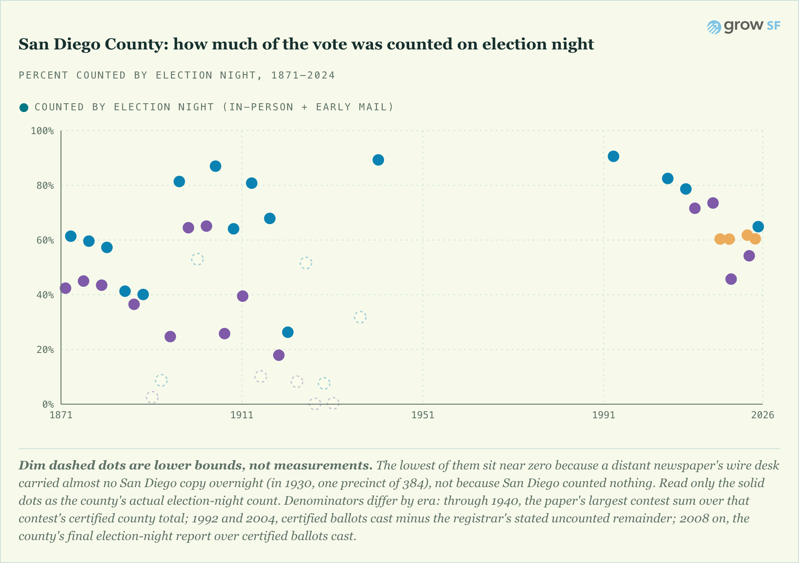

# `data/research/san-diego-history/`: San Diego County election-night history, 1871-2004



*Rendered by the site's own `NightShareChart` component (the same one that draws
the San Francisco series), fed by `packages/data/sd_night_history.json` which
`scripts/build_sd_history.py` bakes from this CSV plus the modern panel. Solid
dots are San Diego's actual election-night count. Dim dashed dots are LOWER
BOUNDS, not measurements: the paper printed majorities instead of votes, omitted
the city, gave only a city-only proxy, or (for the dots near zero) carried just
a remote wire desk's overnight scrap of San Diego copy. 1882 and the five
afternoon-clocked ceilings are off the chart entirely. To regenerate the image:
run the preview harness
(`pnpm --filter @long-count/preview exec vite`) and
`node scripts/shoot_charts.cjs`.*

Recovered morning-after (election-night) vote counts for San Diego County,
extending the county's election-night record back from the modern panel
(`../election-night/san-diego-ca.json`, 2008-2024) into the newspaper era. This
reproduces, for San Diego, the San Francisco "century of election nights"
recovery (`docs/analysis/2026-06-13-a-century-of-election-nights.md`), from a
different archive: the San Diego Union on CDNC (cdnc.ucr.edu, paper code
`SDDU`, digitized 1871-1922).

Full per-election evidence (transcribed precinct rows, scan paths, gate
results, human-verification asks) lives in the campaign dossiers at
[`docs/research/night-recovery-2026-07-11-san-diego/`](../../../docs/research/night-recovery-2026-07-11-san-diego/);
this dataset is the promoted summary, one row per election. The narrative
analysis is
[`docs/analysis/2026-07-12-san-diego-century.md`](../../../docs/analysis/2026-07-12-san-diego-century.md).

## The metric (differs from the SF chart's denominator; do not mix silently)

```
night_share_pct = night_floor / certified_contest_total
```

- `night_floor`: the largest SINGLE-SEAT contest sum (all candidates in that
  one contest) printed in the day-after paper, city + county as reported.
  Multi-seat races are never summed. Always a FLOOR: precincts are partial, and
  some papers omit minor candidates. Which paper supplied each row, and how much
  that floor can be trusted, is in the coverage table below; they are not
  equally good.
- `certified_contest_total`: the SAME contest's certified San Diego County
  total from the CA SoS Statement of Vote / CA Blue Book (see the campaign's
  `denominators.md` for per-candidate figures and page-image provenance).
  Presidential contests use the highest-elector-per-slate convention; the
  per-elector spread (a few votes) is recorded there.
- For every row except 1992 and 2004 this is a same-contest share, NOT the SF chart's
  contest-sum / certified-ballots-cast share. The 1992 and 2004 rows are the
  documented exception: they are news-derived, their `contest` is `ballots
  cast (news-derived)`, and both numerator and denominator are certified
  BALLOTS CAST (certified minus the registrar's stated uncounted remainder);
  see the `flags` column and the coverage table below. Same-contest is
  cleaner (no undervote in the denominator) and makes these values slightly
  HIGHER than the SF-definition equivalents; any chart mixing the two
  jurisdictions must say so.

## `sd_night_history.csv` columns

| column | meaning |
|---|---|
| `election_date` | YYYY-MM-DD |
| `election_type` | presidential-general / gubernatorial-general |
| `contest` | the single-seat contest summed; for the 1992/2004 news-derived rows this reads `ballots cast (news-derived)` instead |
| `night_floor` | ballots in that contest per the morning-after paper (int) |
| `precincts_basis` | precincts-reported statement as printed (verbatim-ish) |
| `certified_contest_total` | certified SD county total for the same contest; for the 1992/2004 news-derived rows this is certified total BALLOTS CAST (SoS voter-participation statistics) |
| `night_share_pct` | round(100 * night_floor / certified_contest_total, 1) |
| `confidence` | high / medium / low per the dossier (transcription confidence) |
| `flags` | comparability caveats (city-only, minor-tickets-unprinted, ...) |
| `night_source` | issue + section OID(s) + screenshot basename(s) |
| `certified_source` | SOV / Blue Book item + leaf, from denominators.md |
| `dossier` | the per-election evidence file |

## Coverage and gaps

40 rows: **34 carry a share and are charted**, 6 do not. Six source families,
each with its own denominator basis and its own reliability. Read this table,
not the free-text `flags` column, to know what a row is.

| era | source | what it is | rows |
|---|---|---|---|
| 1871-1920 | **San Diego Union** (a MORNING paper), day-after, via CDNC | The county's own count as of press time. The backbone of the dataset, and the only long run that measures counting speed directly. | 25 (1871/1875/1879 were September state elections) |
| 1936, 1940 | **San Diego County's own papers**, election SPECIAL editions, via CDNC | Evening papers that rushed out an overnight/dawn extra for a big election, which makes them night-clocked and valid. 1940 (114,410 of 128,110, 550/596 precincts, 89.3%) is the strongest point of the era. 1936's extra went to press with only 167 precincts in, so it is a lower bound. | 2 |
| 1914, 1922, 1924, 1926, 1928, 1930 | AP county tables and wire dispatches in **REMOTE** papers (Sacramento Union, LA Examiner), via CDNC | **Wire-coverage artifacts.** These measure how much San Diego copy a distant wire desk carried overnight, NOT how fast San Diego counted. In 1930 that was ONE precinct of 384 (197 ballots); in 1926, two of 308 (22 ballots). Charted as dim lower bounds because they are the only witness those years have. Never read the y-value as a counting-speed measurement, and never trend through them. | 6 |
| 1932, 1934, 1942, 1944, 1950 | San Diego County's own **EVENING** papers, routine day-after editions, via CDNC | **CEILINGS.** Their returns are clocked to the afternoon AFTER election day, when the canvass had already resumed. They bound the night from ABOVE, the opposite of what the chart's axis means, so they carry a NULL share and are excluded from the chart entirely. | 5 |
| 1992, 2004 | San Diego Union-Tribune via NewsBank text (SDUB) | `news-derived`: certified **ballots cast** minus the registrar's stated uncounted remainder. A different denominator from every row above. | 2 |
| 1882 | San Diego Union | Recovered (1,103 ballots), but **no certified denominator exists** in any digitized source, so the share is NULL and it is off the chart. | 1 rows-worth, counted in the 25 above |

### The one rule that governs all of it

A day-after issue is a night-count source **only if the paper was a morning
paper, or ran a morning special**. An evening paper's routine day-after edition
reports a count that already resumed the multi-day canvass. That single test is
what separates the 1940 win (a 6 a.m. special, valid) from the 1932 ceiling (a
routine afternoon edition, invalid), and it is written up in the campaign
README's "morning/afternoon trap" section.

### Still dark, each probed and documented rather than silently skipped

- **1938, 1946, 1948, 1952-1990**: no county-level night figure found. The AP
  county-table format had vanished from the sampled papers by 1952, and no
  election special surfaced in the years probed. Hunting for more specials is
  the live lead (`sd-local-papers-probe.md`).
- **1994-2006**: Wayback's captures of the Secretary of State and registrar
  election-night pages fall in gaps that swallow election night itself
  (`wayback-probe-1994-2010.md`). Of the news-quote years, 1988 and 2008 bound
  only ONE ballot category (absentees, provisionals) so yield no sound floor;
  1996 has no countable figure; 2000 has only a day+2 canvass figure, admissible
  as a ceiling (828,569, 84.7%) but never a floor.
- **The structural reason.** The San Diego Union, the one paper that would
  settle every dark year properly, is not digitized after 1922. This was tested
  directly: CDNC returns "no such issue" for its post-1922 dates, as opposed to
  the rolling-embargo lock screen it shows for other papers, so there is no
  release date to wait for. The only confirmed route to that paper for 1922-1990
  is a personal Newspapers.com subscription; no library card within reach
  provides it (`newspapers-com-probe.md`). One narrow exception is worth a
  revisit: the Sacramento Union's 1930 issue IS embargoed rather than absent,
  and unlocks 23 September 2026, though it would only improve a wire artifact.

2008-2024 rows live in the cross-county panel
(`../election-night/san-diego-ca.json`), not here; the chart above draws both.

## Provenance rules

Same as the rest of `data/research/`: every number is re-findable (dossier
carries the exact page OID, zoom point, and screenshot), scans stay in the
gitignored `mirror/cdnc/` tree (licensed content), only figures + citations
are committed, and corrections append rather than rewrite (see each dossier's
"Verification pass" appendix).
